<div align="center">

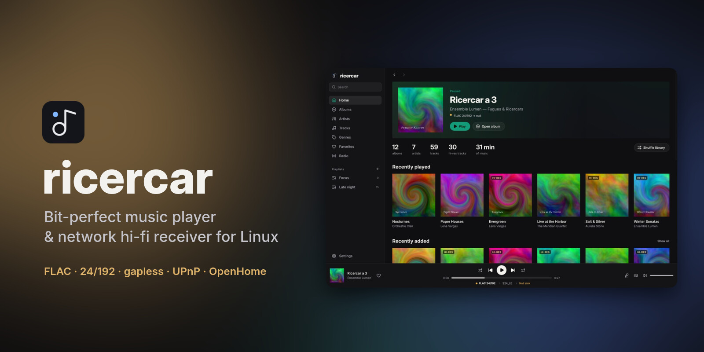

<br>

**Your lossless library and your streaming apps, played untouched to your DAC.**<br>
A native Linux music player that is also a UPnP / OpenHome network receiver.

[](https://github.com/ricercar-player/ricercar/actions/workflows/ci.yml)
[](LICENSE)
[](https://www.rust-lang.org)

[](https://slint.dev)


[Features](#-features) ·
[Screenshots](#-screenshots) ·
[Install](#-install) ·
[Stream from your phone](#-stream-from-your-phone) ·
[Bit-perfect](#-bit-perfect-for-real) ·
[FAQ](#-faq) ·
[Roadmap](#-roadmap)

</div>

---

## ✨ Why ricercar

Most Linux players either sound right or look right. ricercar tries to do both:

- **It never touches your samples.** Every track goes to an exclusive `hw:`
  ALSA device at its native rate and bit depth: no mixer, no resampling, no
  volume maths. A format the DAC can't take is refused, never quietly
  converted.
- **It shows the signal path instead of just claiming bit-perfect.** The
  chain (source → processing → output format → DAC) sits under the seek bar
  at all times; one click opens every hop and flags anything that changes
  the samples.
- **It is a real desktop app.** Album grid, artist pages, synced lyrics,
  queue, playlists, radio and search, native and fast, with no webview and no
  Electron.
- **It plays what your phone streams.** Control points such as BubbleUPnP,
  Symfonium or Linn Kazoo can push your NAS, or a service they support, to
  ricercar the way they would to a hi-fi network streamer (protocol-tested;
  real-app reports welcome).

> ricercar is **inspired by QBZ** but is a clean-room project with no QBZ
> code. The core contains **no private or unofficial streaming-service
> API**. Catalogues reach it through standard UPnP / OpenHome, with your own
> subscription in your own app, or through a **source plugin** you install
> yourself: a separate program the core only talks to through a documented
> protocol ([docs/plugins.md](docs/plugins.md)). The core ships no service
> code, keys or plugins.

## 🎧 Features

<table>
<tr>
<td width="50%" valign="top">

### Audio
- Bit-perfect `hw:` output, exclusive access
- Native sample-rate switching per track
- Lossless container negotiation (S16 · S24_3LE · S24 · S32) for picky USB DACs
- DAC capabilities in Settings: accepted rates and containers, and which
  albums of your library it cannot play natively
- Gapless, sample-exact within a rate
- FLAC · ALAC · WAV · AIFF · AAC · MP3 · Ogg Vorbis
- Hardware pause, device hot-switch, clean stop on unplug
- ReplayGain (track / album / auto) with peak protection (off by default)
- HTTP streams seek at once with Range requests (sequential fallback);
  internet radio with live titles

</td>
<td width="50%" valign="top">

### Library
- Fast incremental indexing with a folder watcher
- Instant accent-insensitive search (`bjork` finds Björk)
- Albums, artists (with "appears on"), genres, all tracks
- Favorites, play counts, history, most played
- Playlists with M3U / M3U8 import & export
- Covers: embedded, folder images, or Cover Art Archive
- Synced lyrics from `.lrc` files, tags, source plugins or lrclib.net

</td>
</tr>
<tr>
<td valign="top">

### Desktop app
- Listening header: what plays, and how it reaches the DAC
- Format column on every track list (hi-res in gold)
- Full-screen now playing with synced, clickable lyrics
- Colours that follow the playing album cover
- Queue drawer with drag-to-reorder, context menus everywhere
- Dark & light themes, 7 accents, six languages
- Keyboard shortcuts and full keyboard navigation (focus rings,
  Space/Enter, arrows on sliders), notifications, tray icon
- Diagnostic report and rotating log for compatibility reports
- Remembers your queue and position, and reopens as you left it (window
  size, page, sorts)

</td>
<td valign="top">

### Network & integration
- **UPnP AV MediaRenderer + OpenHome** (Product, Playlist, Info, Time, Volume) on one device
- **UPnP MediaServer**: browse your library from any DLNA app
- **Choice of network interface**: announce and serve on one interface
  only (VPN, Docker, virtual machines)
- **MPRIS**: media keys, desktop widgets, `playerctl`
- **Scrobbling** to ListenBrainz & Last.fm (offline queue)
- **Source plugins**: catalogues from third-party programs, installed from
  the [community hub](https://github.com/ricercar-player/ricercar-plugins) or
  declared by hand (browse, search, sign-in in your browser); their albums,
  artists and tracks join your library pages and search; playback stays
  bit-perfect. Plugins can also bring their own settings (gear button on
  the Plugins page), lyrics, favourites, "Go to album / artist / label",
  extra menu actions, playlists you edit on the service, artist biographies
  and related shelves, and radios, with optional continuous playback when
  the queue ends (off by default)
- **Updates**: a new release or plugin update is shown in the app; Settings →
  About checks on demand and installs the new release (AppImage, or the
  .deb / .rpm / pacman package through your password prompt), checked
  against its SHA256SUMS, itself signed with the project's minisign key
- **English, French, German, Spanish, Italian and Japanese** interface,
  chosen in Settings or from the system; plugins get the same language
- `ricercar-cli` remote and a headless daemon for a dedicated audio box

</td>
</tr>
</table>

## 📸 Screenshots

<table>
<tr>
<td>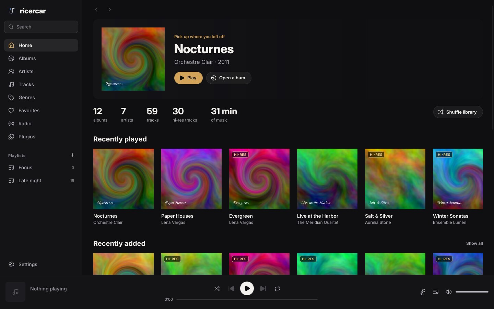</td>
<td>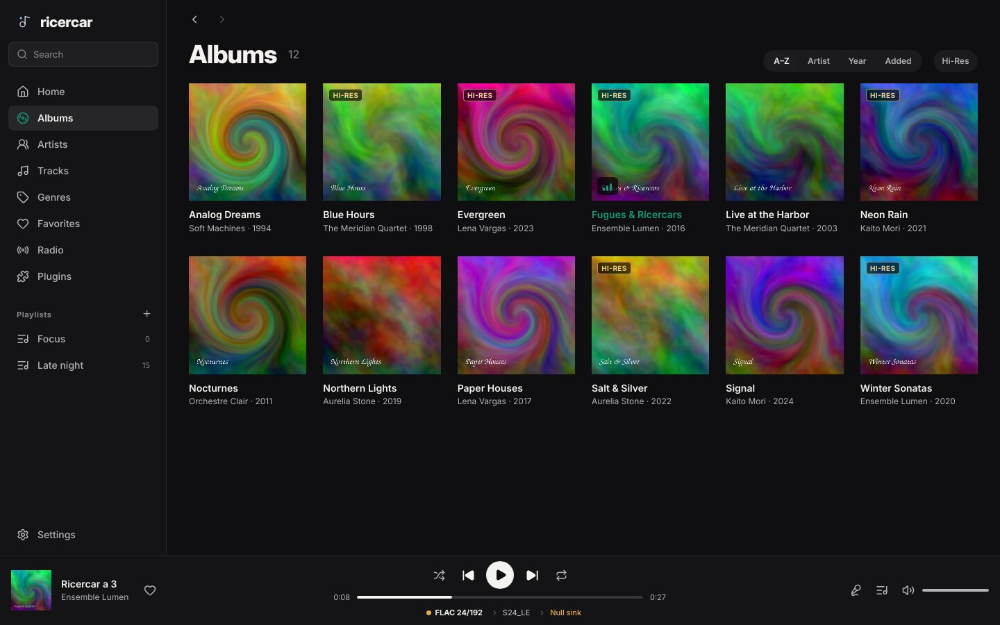</td>
</tr>
<tr>
<td align="center"><sub><b>Home</b>: what is playing and how it reaches the DAC</sub></td>
<td align="center"><sub><b>Albums</b>: grid with hi-res badges, on-air chip</sub></td>
</tr>
<tr>
<td>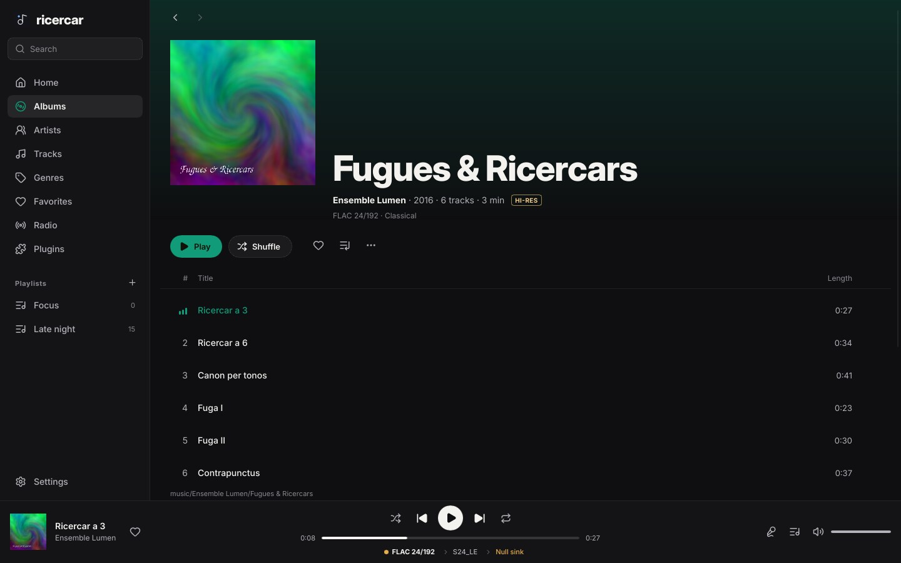</td>
<td>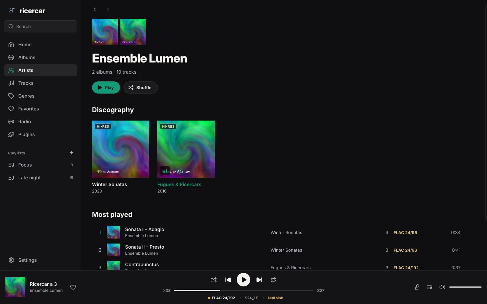</td>
</tr>
<tr>
<td align="center"><sub><b>Album</b>: Play / Shuffle, format in the header</sub></td>
<td align="center"><sub><b>Artist</b>: sleeves on a shelf, discography, most played</sub></td>
</tr>
<tr>
<td>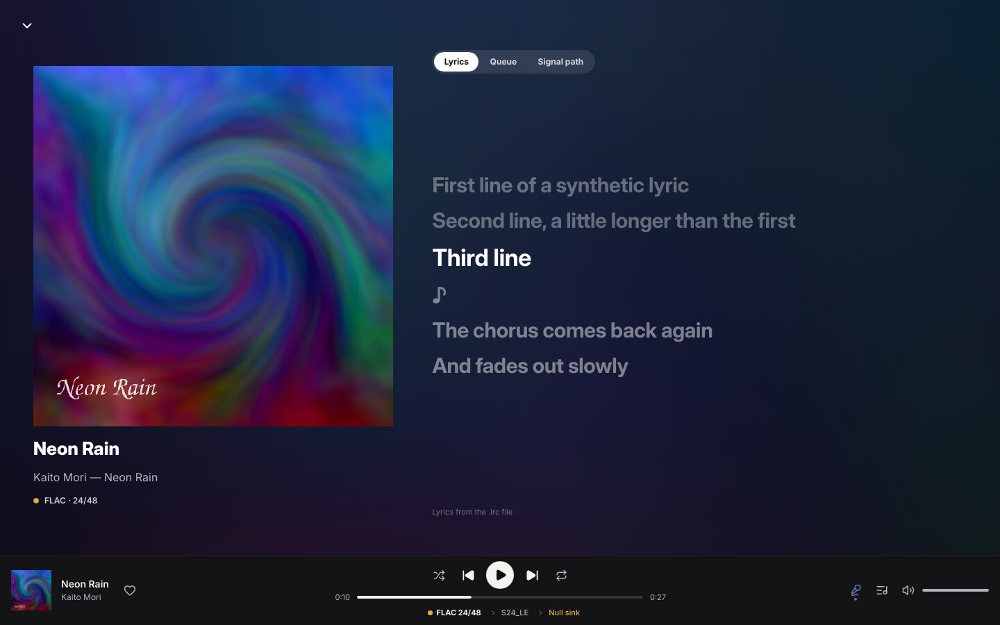</td>
<td>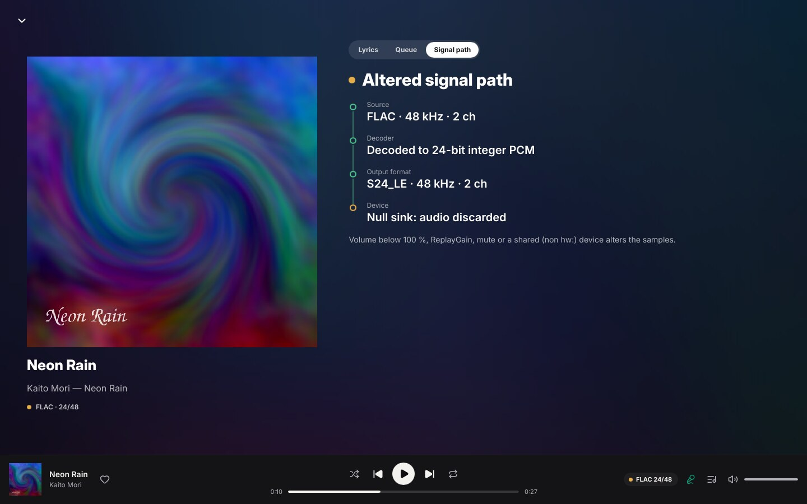</td>
</tr>
<tr>
<td align="center"><sub><b>Now playing</b>: synced lyrics over the cover</sub></td>
<td align="center"><sub><b>Signal path</b>: every hop from file to DAC</sub></td>
</tr>
<tr>
<td>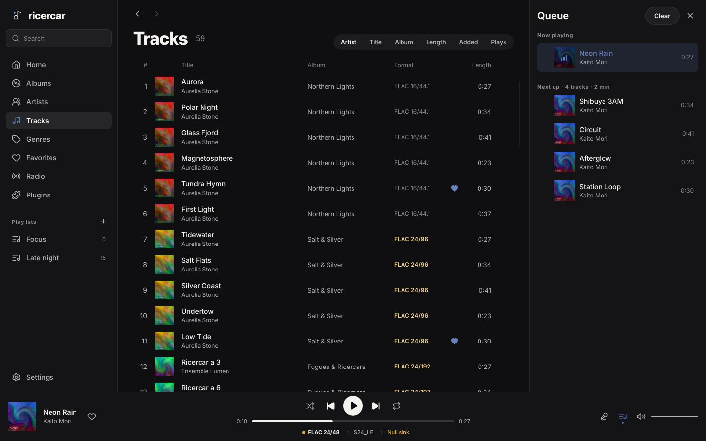</td>
<td>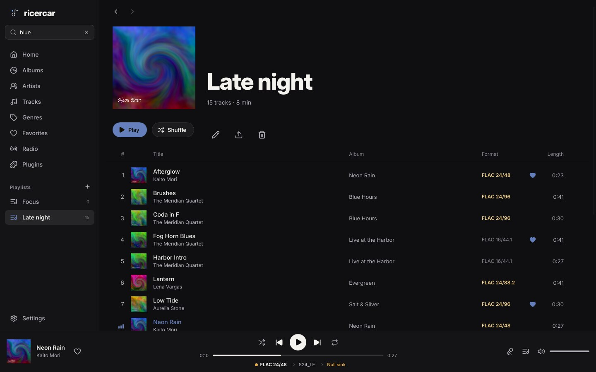</td>
</tr>
<tr>
<td align="center"><sub><b>Tracks + queue</b>: Format column, drag to reorder</sub></td>
<td align="center"><sub><b>Playlists</b>: M3U import / export</sub></td>
</tr>
<tr>
<td>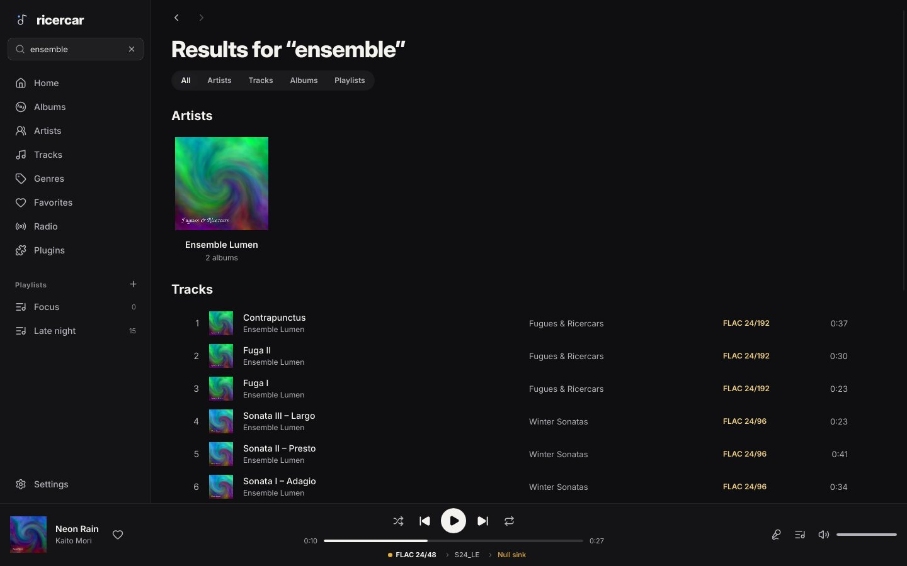</td>
<td>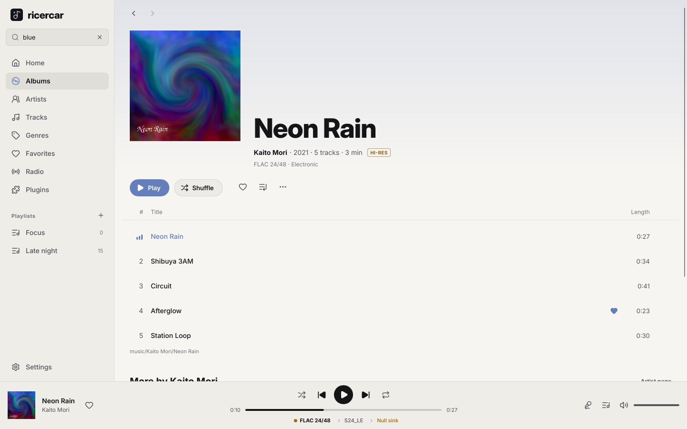</td>
</tr>
<tr>
<td align="center"><sub><b>Search</b>: artists, tracks, albums</sub></td>
<td align="center"><sub><b>Light theme</b></sub></td>
</tr>
<tr>
<td>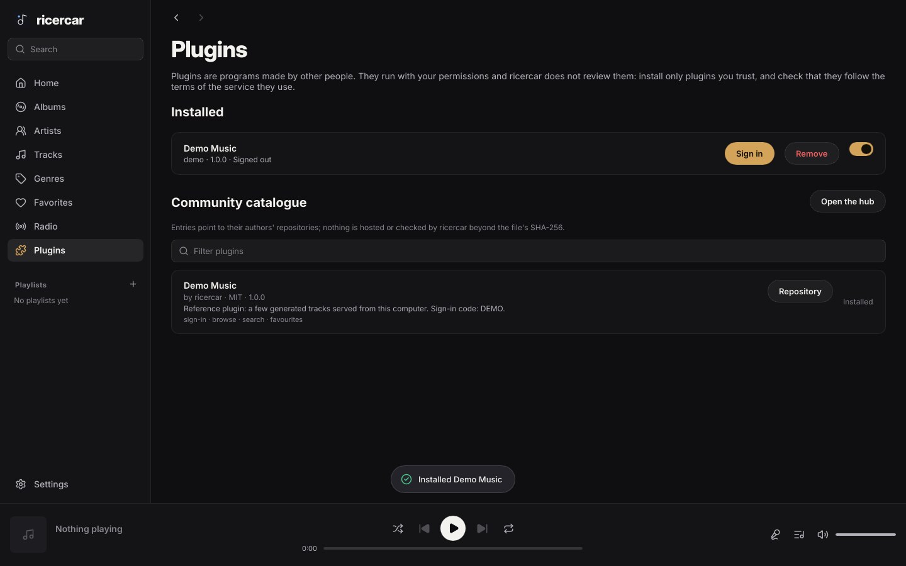</td>
<td>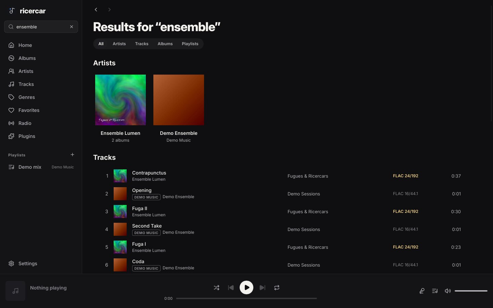</td>
</tr>
<tr>
<td align="center"><sub><b>Plugins</b>: installed, and the community catalogue</sub></td>
<td align="center"><sub><b>Plugins in your library</b>: one search, source badges (demo plugin)</sub></td>
</tr>
</table>

<sub>Screenshots use a synthetic demo library (generated tones and artwork).
They are rendered with `RICERCAR_SNAPSHOT`, see [Development](#-development).</sub>

## 📦 Install

### Download a package

Every [release](https://github.com/ricercar-player/ricercar/releases/latest) ships
ready-made packages. The `.deb`, `.rpm`, `.AppImage` and tarball exist for
**x86_64** and **aarch64**; the Arch package is **x86_64** only (on aarch64
Arch, build it from source with `dist/arch/PKGBUILD`):

| Your system | Package | Install |
|---|---|---|
| Debian, Ubuntu, Mint, Pop!_OS… | `.deb` | `sudo apt install ./ricercar_*.deb` |
| Fedora, openSUSE Tumbleweed / Leap 16, RHEL / Alma / Rocky 10+ | `.rpm` | `sudo dnf install ./ricercar-*.rpm` (`zypper install` on openSUSE) |
| Arch, Manjaro, EndeavourOS, CachyOS, Omarchy | `.pkg.tar.zst` | `sudo pacman -U ricercar-*.pkg.tar.zst` |
| Anything else | `.AppImage` | `chmod +x ricercar-*.AppImage && ./ricercar-*.AppImage` |

Packages need glibc 2.35 or newer (Ubuntu 22.04, Debian 12, Fedora 36,
RHEL 10 and later).

To check a download, verify the signed checksum list with
[minisign](https://jedisct1.github.io/minisign/) and the key in
[`dist/minisign.pub`](dist/minisign.pub), then the file itself:

```sh
minisign -Vm SHA256SUMS -P RWSLPLWZ/M4/9X1orGjyBkKYA7BmzgxxI8dveJ8YVcSQVrOpjinxS9fV
sha256sum --check --ignore-missing SHA256SUMS
```

### From source

<details open>
<summary><b>Arch / Manjaro / Omarchy</b></summary>

```sh
sudo pacman -S --needed rust clang alsa-lib fontconfig libxkbcommon
git clone https://github.com/ricercar-player/ricercar && cd ricercar
cargo build --release
```

Or build the package: `cd dist/arch && makepkg -si`.
</details>

<details>
<summary><b>Debian / Ubuntu</b></summary>

```sh
# the distribution's cargo is too old: install Rust 1.92+ with https://rustup.rs
sudo apt install libasound2-dev libfontconfig1-dev libxkbcommon-dev pkg-config clang libclang-dev
git clone https://github.com/ricercar-player/ricercar && cd ricercar
cargo build --release
```
</details>

<details>
<summary><b>Fedora</b></summary>

```sh
sudo dnf install cargo clang alsa-lib-devel fontconfig-devel libxkbcommon-devel
git clone https://github.com/ricercar-player/ricercar && cd ricercar
cargo build --release
```
</details>

Rust 1.92 or newer is required. The binaries end up in `target/release/`:

| binary | what it is |
|---|---|
| `ricercar` | the desktop app (`--headless` for no window) |
| `ricercar-daemon` | headless player + UPnP + MPRIS, for a dedicated box |
| `ricercar-cli` | remote control over MPRIS |

Desktop integration: copy `dist/ricercar.desktop` to
`~/.local/share/applications/` and `dist/ricercar.svg` to
`~/.local/share/icons/hicolor/scalable/apps/`.

The systemd user unit (`dist/ricercar.service`, also in the release tarball
under `lib/systemd/user/`) starts `/usr/bin/ricercar-daemon`. If you run the
binaries from somewhere else, such as an unpacked tarball or `~/.local/bin`,
fix `ExecStart=` before copying the unit to `~/.config/systemd/user/`.

<details>
<summary><b>Packaging ricercar for a distribution</b></summary>

The official packages install an empty marker file,
`/usr/share/ricercar/self-update`, which lets **About → Check for updates**
replace the installed .deb / .rpm / pacman package in place. Distribution
packages should **not** ship that file: without it the app only tells users
that a new version exists and leaves upgrades to the package manager.
Setting `RICERCAR_NO_SELF_UPDATE=1` in the environment disables in-place
updates as well.

Install `dist/io.github.ricercar_player.ricercar.metainfo.xml` into
`/usr/share/metainfo/`, and the third-party notices into
`/usr/share/licenses/ricercar/`: `THIRD-PARTY-LICENSES` (written to
`target/` by `dist/third-party-licenses.sh`, which needs
[cargo-about](https://github.com/EmbarkStudios/cargo-about)),
`crates/ricercar-ui/assets/fonts/OFL.txt` and
`crates/ricercar-ui/assets/icons/LICENSE` (as `icons-LICENSE`).
</details>

### First run

1. `./target/release/ricercar`. Your XDG music folder (usually `~/Music`)
   is indexed automatically; add others in **Settings → Library**.
2. Pick your DAC in **Settings → Audio output**. `hw:` devices are marked
   **BIT-PERFECT**; `default` / `pipewire` are marked **SHARED** (they go
   through the system mixer).
3. Press play. The green dot on the chain line under the seek bar means
   bit-perfect.

```sh
./target/release/ricercar --print-devices   # list outputs
```

## 📱 Stream from your phone

ricercar shows up on your network as a renderer, just like a hardware
streamer. Your phone app handles sign-in and browsing, and ricercar fetches
the audio itself.

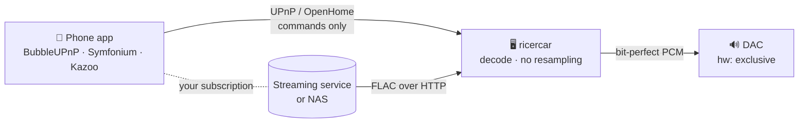

1. Start ricercar on the PC wired to your DAC (desktop app or daemon).
2. In your phone app, choose **ricercar** as the renderer. With OpenHome
   (BubbleUPnP, Kazoo…) the queue lives on the PC and your phone can sleep.
3. Play anything the app can reach. ricercar's player bar, MPRIS and the
   signal-path view show exactly what reaches the DAC.

See [docs/CONTROLS.md](docs/CONTROLS.md) for the control-point compatibility
matrix and what the protocol tests cover.

Phone app doesn't see ricercar, or sees it at a strange address? On machines
with a VPN, Docker or virtual machines, ricercar is announced on every
interface. Pick your home network under **Settings → Network → Network
interface** (or `interface = "eth0"` in `[network]`, `--interface eth0` on
the command line): ricercar then listens and announces there only. If that
interface goes away (cable unplugged, Wi-Fi down), sharing pauses and comes
back on its own when the interface has an address again.

For an always-on audio box:

```sh
systemctl --user enable --now ricercar   # uses dist/ricercar.service
```

## 🎚️ Bit-perfect, for real


When the output is a `hw:` device, the volume is at 100 %, ReplayGain is off
and nothing is muted, samples reach the kernel **untouched**:

- the device is opened at the track's native rate and channel count, and a
  mismatch is refused, not resampled;
- the container holds every bit (16-bit audio may travel zero-padded in S32
  if that is all the DAC accepts, which is still bit-perfect);
- a rate change between tracks drains and reopens the device; within one
  rate, gapless is sample-exact.

The signal-path view marks each hop green (untouched) or amber (altered:
software volume, ReplayGain, a shared device…). The pipeline tests compare
decoded output **byte for byte** against ffmpeg references for every
container.

<br clear="right">

## ⌨️ Keyboard

| Keys | Action | | Keys | Action |
|---|---|---|---|---|
| <kbd>Space</kbd> | Play / pause | | <kbd>Ctrl</kbd> <kbd>F</kbd> or <kbd>Ctrl</kbd> <kbd>K</kbd> | Search |
| <kbd>Ctrl</kbd> <kbd>→</kbd> / <kbd>←</kbd> | Next / previous | | <kbd>Ctrl</kbd> <kbd>L</kbd> | Now playing & lyrics |
| <kbd>→</kbd> / <kbd>←</kbd> | Seek ± 10 s | | <kbd>Ctrl</kbd> <kbd>Q</kbd> | Queue |
| <kbd>Ctrl</kbd> <kbd>↑</kbd> / <kbd>↓</kbd> | Volume | | <kbd>Alt</kbd> <kbd>←</kbd> | Back |
| | | | <kbd>Esc</kbd> | Close menu / panel |

<kbd>Tab</kbd> moves between controls, <kbd>Space</kbd> or <kbd>Enter</kbd>
activates, and the arrows adjust sliders and choices.

## ⚙️ Configuration

Everything is editable in **Settings**. It is stored in
`~/.config/ricercar/config.toml`, and command-line flags override it for
one run.

```toml
[audio]
device = "hw:1,0"          # see --print-devices
replaygain = "off"         # off | track | album | auto
preamp_db = 0.0
restore_session = true
continuous_playback = false  # more tracks from a plugin radio when the queue ends

[library]
roots = ["/home/me/Music", "/mnt/nas/flac"]
watch = true

[network]
name = "Living room"       # name shown in phone apps
renderer = true            # UPnP AV + OpenHome renderer
media_server = true        # share the library over UPnP
interface = "eth0"         # serve on this interface only; omit for all

[ui]
theme = "dark"             # dark | light
accent = "#d4a35a"
adaptive_colors = true     # tint the UI from the album cover
notifications = true
tray = true
close_to_tray = false
language = ""              # en, fr, de, es, it, ja; empty follows the system

[scrobble]
listenbrainz_token = ""
lastfm_api_key = ""        # your own Last.fm API account…
lastfm_secret = ""         # …and its secret (the sign-in fills the session)

[online]
lyrics = true              # lrclib.net when no local lyrics exist
cover_art = true           # MusicBrainz / Cover Art Archive for missing covers
radio = true               # Radio Browser directory (Radio page)
plugin_catalog = true      # community plugin catalogue (GitHub)
updates = true             # new release and plugin updates, once a day

[[plugins]]                # one table per plugin, see docs/plugins.md
id = "example"
command = "/usr/local/bin/example-plugin"
enabled = true
[plugins.settings]         # values of the settings the plugin declares
```

<details>
<summary><b>Command line</b></summary>

```text
ricercar [FILE|URI]... [--headless] [--config FILE] [--device NAME] [--name NAME]
         [--db PATH] [--library DIR]... [--interface IFACE] [--no-mpris] [--no-upnp]
         [--no-session]
ricercar --print-devices
ricercar --help | --version       # ricercar-daemon takes the same flags

ricercar-cli status | play | pause | toggle | stop | next | prev
ricercar-cli open FILE|URI      seek ±SECONDS      volume [0..1]
ricercar-cli shuffle [on|off]   repeat [none|track|playlist]   metadata
```

Only one instance owns the DAC: `ricercar song.flac` while ricercar is
running hands the file to the running instance.
</details>

<details>
<summary><b>Where things are stored</b></summary>

| path | content |
|---|---|
| `~/.config/ricercar/config.toml` | settings |
| `~/.local/share/ricercar/library.db` | library index, stats, playlists |
| `~/.local/share/ricercar/session.json` | queue & position |
| `~/.local/share/ricercar/radio.json` | saved radio stations |
| `~/.local/share/ricercar/ui-state.json` | window size, last page, sorts, DAC capabilities |
| `~/.local/state/ricercar/ricercar.log` | log (3 × 2 MB, rotated) |
| `~/.local/share/ricercar/plugins/<id>/` | a plugin's own data (ricercar never reads it) |
| `~/.local/share/ricercar/plugin-bin/<id>/` | plugins installed from the hub |
| `~/.cache/ricercar/` | cover thumbnails, lyrics, stream spool, update check (`update.json`), plugin caches (`plugins/<id>/`) |
</details>

## 🔒 Privacy

ricercar works fully offline. Its optional online features contact only:

| service | used for | toggle |
|---|---|---|
| lrclib.net | synced lyrics | Settings → Online extras |
| MusicBrainz / Cover Art Archive | missing album covers | Settings → Online extras |
| Radio Browser | the Radio page | opening the Radio page · `radio = false` in `[online]` |
| ListenBrainz / Last.fm | scrobbling | only with your own credentials |
| GitHub (raw.githubusercontent.com) | community plugin catalogue | opening the Plugins page · Settings → Online extras |
| a plugin author's download host | the plugin binary | only when you click Install or Update |
| GitHub (api.github.com, raw.githubusercontent.com) | new ricercar release, plugin updates (at most once a day at startup) | Settings → Online extras → Updates |
| GitHub (github.com release files) | the new ricercar release | only when you click Check for updates or Update now (Settings → About) |

No telemetry, no account, and never a streaming-service API in ricercar
itself. Plugins you declare are separate programs: what they contact is up
to them. ricercar tells them the interface language, so they can translate
their pages, and, only for plugins that ask for it, what you play (see
their settings to turn that off).

## 🏗️ Architecture

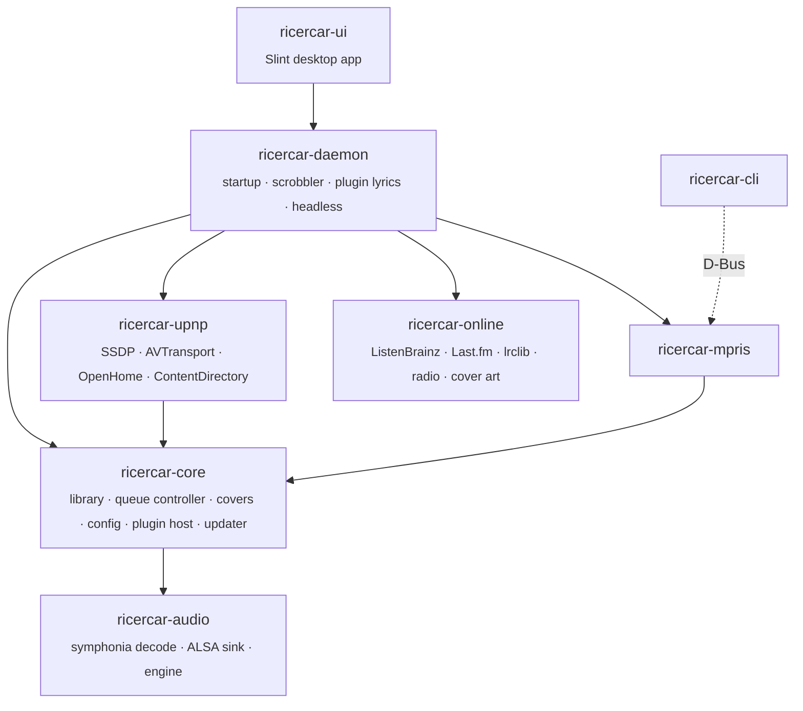

| crate | role |
|---|---|
| [`ricercar-audio`](crates/ricercar-audio) | decode + sink pipeline, engine thread, HTTP spooling with Range seeking |
| [`ricercar-core`](crates/ricercar-core) | SQLite/FTS5 library, tags, covers, queue controller, config, source-plugin host and hub catalogue, updater |
| [`ricercar-upnp`](crates/ricercar-upnp) | SSDP / HTTP / SOAP / GENA, AVTransport, OpenHome, MediaServer, interface selection |
| [`ricercar-mpris`](crates/ricercar-mpris) | `org.mpris.MediaPlayer2` on the session bus |
| [`ricercar-online`](crates/ricercar-online) | scrobbling, lyrics, radio directory, cover art |
| [`ricercar-daemon`](crates/ricercar-daemon) | shared startup, scrobbler, plugin lyrics, diagnostic report, headless binary |
| [`ricercar-ui`](crates/ricercar-ui) | Slint desktop app (`ricercar` binary) |
| [`ricercar-cli`](crates/ricercar-cli) | MPRIS remote control |

## 🛠️ Development

```sh
cargo fmt --all --check
cargo clippy --workspace --all-targets -- -D warnings
dbus-run-session -- cargo test --workspace --locked   # 320+ tests
```

- **Your speakers are safe:** tests only use `null` and `file:` sinks; no
  audio is sent to hardware during `cargo test`.
- **Screenshots without a display:**
  `RICERCAR_SNAPSHOT=out/ ricercar --device null --no-upnp --no-mpris --library <dir>`
  renders the main views with Slint's software renderer and writes PNGs.
- **Translations:** French strings live in
  `crates/ricercar-ui/tools/fr.json`; run `tools/gen_po.py` after changing
  UI text (CI checks that the catalogue is up to date).

## ❓ FAQ

<details>
<summary><b>Is this a streaming-service client?</b></summary>

No. ricercar itself never talks to a streaming service's API. Your phone
app, used with your own subscription, sends ricercar a plain stream URL over
UPnP or OpenHome, the way it would to a network streamer.

ricercar can also run **source plugins**: separate programs, written by
third parties and installed by you, that bring a catalogue and hand ricercar
playable URLs ([docs/plugins.md](docs/plugins.md)). The
[community hub](https://github.com/ricercar-player/ricercar-plugins) lists them with
links to their authors; it hosts no plugin code and reviews none. A plugin
runs with your permissions: install only plugins you trust, and check that
they respect the terms of the service they use.
</details>

<details>
<summary><b>Why is my track "altered" and not bit-perfect?</b></summary>

Open the signal-path view (click the chain line under the seek bar). Common
causes: volume below 100 %, ReplayGain enabled, mute, or a shared output
(`default`, `pipewire`, `pulse`) instead of a `hw:` device.
</details>

<details>
<summary><b>My DAC refuses a track.</b></summary>

With a `hw:` device, ricercar refuses a rate or bit depth that the DAC can't
play natively rather than resampling it. Pick the `pipewire` / `default`
output if you prefer conversion over refusal.
</details>

<details>
<summary><b>Does it work with PipeWire?</b></summary>

Yes. Selecting a `hw:` device takes the card exclusively while ricercar
plays and releases it on stop. Choose `pipewire` if you want to share the
card with other apps (not bit-perfect). Bluetooth headphones and other
outputs that only exist in PipeWire are listed by name, also shared.
</details>

<details>
<summary><b>My phone app doesn't see ricercar.</b></summary>

Check that the phone and the computer are on the same network, and that the
renderer is on (Settings → Network). With a VPN, Docker or virtual
machines, pick your home network under **Settings → Network → Network
interface** so ricercar announces itself there.
</details>

<details>
<summary><b>Can I run it on a Raspberry Pi without a screen?</b></summary>

Yes. Use `ricercar-daemon` (or `ricercar --headless`) with the systemd user
unit in `dist/`, and control it from your phone over UPnP / OpenHome.
</details>

## 🗺️ Roadmap

- [x] Bit-perfect ALSA engine, gapless, native-rate switching
- [x] UPnP AV + OpenHome renderer, UPnP MediaServer
- [x] Desktop app: library, lyrics, queue, playlists, radio, six languages
- [x] Scrobbling, MPRIS, tray, headless daemon
- [x] Device capabilities panel (rates and formats your DAC accepts)
- [x] Source plugins and community hub: settings, lyrics, navigation,
  actions, service playlists, details, radio
- [x] Signed releases (minisign) and in-app updates
- [x] Network interface choice, keyboard navigation, AppStream metadata
- [ ] Reports from real control points ([help wanted](docs/CONTROLS.md))
- [ ] Optional parametric EQ / convolution (clearly marked non bit-perfect)
- [ ] DSD over PCM (DoP), CUE sheets
- [ ] Composer / work views for classical music
- [x] AppImage
- [ ] Flatpak

## 🤝 Contributing

Issues and pull requests are welcome. The most useful contribution right now
is a **compatibility report**: your phone app, its version, your DAC, and
what worked or broke (see [docs/CONTROLS.md](docs/CONTROLS.md)). Please
follow [CONTRIBUTING.md](CONTRIBUTING.md), and note that this repository
does not host any code that bypasses a streaming service's official API.

## 🙏 Acknowledgements

Built on [symphonia](https://github.com/pdeljanov/Symphonia),
[Slint](https://slint.dev), [lofty](https://github.com/Serial-ATA/lofty-rs),
[rusqlite](https://github.com/rusqlite/rusqlite) and
[zbus](https://github.com/dbus2/zbus). Typeface
[Inter](https://rsms.me/inter/) (SIL OFL), icons
[Lucide](https://lucide.dev) (ISC). Data from
[MusicBrainz](https://musicbrainz.org), [Cover Art Archive](https://coverartarchive.org),
[LRCLIB](https://lrclib.net) and [Radio Browser](https://www.radio-browser.info).
Thanks to the QBZ project for showing what a Linux hi-fi player can be.

## 📄 License

[MIT](LICENSE) © ricercar contributors. See [AUTHORS](AUTHORS).

<sub>ricercar is an independent open-source project. It is **not affiliated
with, endorsed by, or connected to** the record label *Ricercar* (Outhere)
or any streaming service. "Ricercar" is used in its old musical
sense: a contrapuntal study, literally "to search".</sub>
